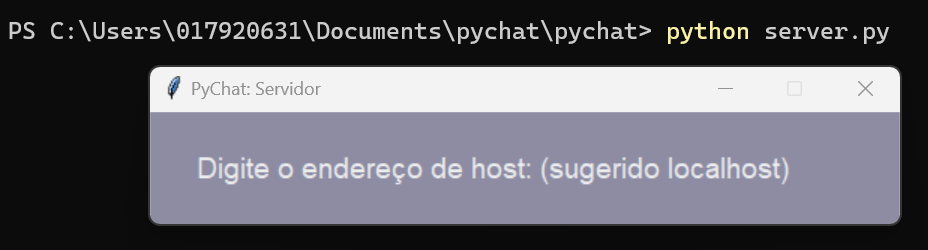

## Pychat

### Propósito do software

O Pychat é um software que visa conectar pessoas já conhecidas e também desconhecidas. Semelhante ao Omegle, o Pychat vai te proporcionar conhecer uma nova pessoa sempre que usa-lo, mas, diferente do Omegle, aqui não temos vídeos ou fotos, ou seja, será uma experiência totalmente livre de preceitos e julgamento, forçando os usuários a contectar-sem verdadeiramente, independente de características físicas, sociais, religiosas, etc.

### Requisitos

    - Python 3.8 ou superior
    - pip
    - pywin32
    - win10toast

#### Instalação

#### Linux

-   Instalar o python 3.8+ `$ sudo apt-get install python3`
-   Instalar o pip `$ sudo apt-get install python3-pip`
-   Instalar dependencias `$ pip install -r requirements.txt`
-   Instalar tkinter `$ sudo apt-get install python3-tk`

#### Windows

-   Instalar o python 3.8+ `Através do windows store`
-   Instalar o pip `Instalado junto ao python`
-   Instalar pywin32 `$ pip install pywin32`
-   Instalar win10toast `$ pip install win10toast`

### Motivação da escolha do protocolo

A escolha do protocolo foi o TCP, pois, apesar do software não pretender carregar nenhum dado sensível, precisamos garantir que as mensagens sejam entregues aos usuários, afinal de contas, esse é o nosso produto. Outra coisa que motivou ainda mais a escolha do TCP em relaçãoa o UDP, é que os pacotes de dados tendem a serem pequenos e não existe uma necessidade de urgência ao ponto de ser necessário optar pela velocidade do UDP (e por suas faltas de garantias)

### Documentação do protocolo

### Documentação do software

Para usar o software é necessário primeiro ter uma máquina como _servidor_ para hostear os _clientes_ que se conectarão entre si

#### Servidor

Para levantar o servidor, basta digitar em, um terminal, o seguinte comando
`python3 servidor.py`

Uma janela irá aparecer para que preencha qual o endereço IP do servidor. Pronto, o servidor está online!

#### Cliente

Para executar o cliente, o processo inicial é semelhante ao servidor, basta executar o seguinte comando
`python3 client.py`

Em seguida aparecerá uma janela pedindo para inserir o id do servidor

Após conectar com o servidor, basta dizer seu nome

Então é aberta a sala de chat, e você está pronto para conversar!

### Sobre o Software

O servidor suporta até 8973 salas de chat de até dois clientes. A escolha da sala é aleatória, mas o cliente de numero par só pode se conectar a uma sala ja existente. 

Um Chat terminado é apagado e poderá ser iniciada novamente. 

Não é possível entrar mais de dois clientes em uma mesma sala, assim como não é possível escolher a sala que você entra, como na inspiração original o Omegle.

O servidor envia notificações a cada vez que um chat recebe uma nova mensagem, ou quando um novo client entra no servidor

#### Diversos

Para fechar o chat(client), basta digitar 'QUIT'
Para encerrar o servidor, digite 'q', e o servidor fechará todos os chats e se encerrará

#### Links para referência:

-   Py Socket documentation ~ https://docs.python.org/3/library/socket.html

-   Py Tkinter documentation ~ https://docs.python.org/3/library/tkinter.html

-   TCP CHAT IN PYTHON ~ https://www.neuralnine.com/tcp-chat-in-python/

-   GUI chat with Tkinter ~ https://www.geeksforgeeks.org/gui-chat-application-using-tkinter-in-python/
