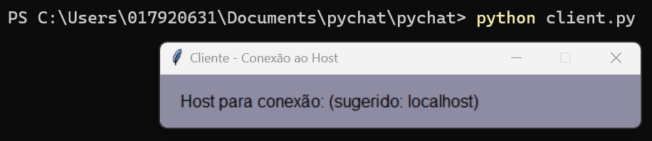
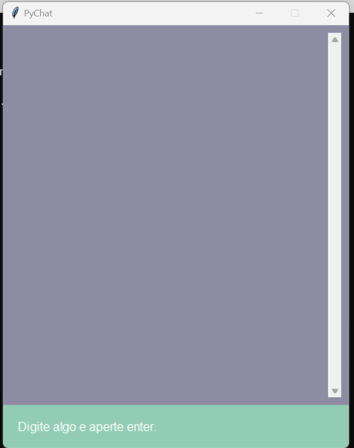
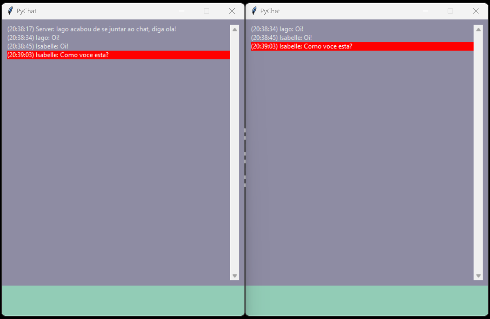
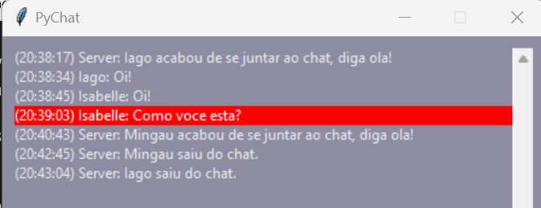
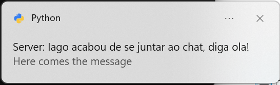
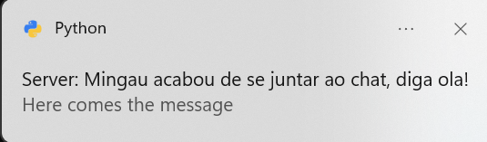
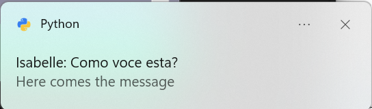

## Pychat

### Propósito do software

O Pychat é um software que visa conectar pessoas já conhecidas e também desconhecidas. Semelhante ao Omegle, o Pychat vai te proporcionar conhecer uma nova pessoa sempre que usa-lo, mas, diferente do Omegle, aqui não temos vídeos ou fotos, ou seja, será uma experiência totalmente livre de preceitos e julgamento, forçando os usuários a contectar-sem verdadeiramente, independente de características físicas, sociais, religiosas, etc.

### Requisitos

    - Python 3.8 ou superior
    - pip
    - pywin32
    - win10toast

#### Instalação

#### Linux

-   Instalar o python 3.8+ `$ sudo apt-get install python3`
-   Instalar o pip `$ sudo apt-get install python3-pip`
-   Instalar dependencias `$ pip install -r requirements.txt`
-   Instalar tkinter `$ sudo apt-get install python3-tk`

#### Windows

-   Instalar o python 3.8+ `Através do windows store`
-   Instalar o pip `Instalado junto ao python`
-   Instalar pywin32 `$ pip install pywin32`
-   Instalar win10toast `$ pip install win10toast`

### Motivação da escolha do protocolo

A escolha do protocolo foi o TCP, pois, apesar do software não pretender carregar nenhum dado sensível, precisamos garantir que as mensagens sejam entregues aos usuários, afinal de contas, esse é o nosso produto. Outra coisa que motivou ainda mais a escolha do TCP em relaçãoa o UDP, é que os pacotes de dados tendem a serem pequenos e não existe uma necessidade de urgência ao ponto de ser necessário optar pela velocidade do UDP (e por suas faltas de garantias)

### Documentação do protocolo
 - Introdução: Nosso socket funciona com threds, podendo dar suporte a multiplas salas de chat. Cada sala de chat é uma porta de conexão e essas portas variam de 1026 a 9999. Cada sala suporta 2 conexões no máximo. A gerência das portas é feita por um banco de dados SQLite, que guarda o valor da porta como id e a quantidade de conexões para a quela porta como um int.

 - Handshake: Ao conectar-se com o servidor principal, o cliente recebera do mesmo uma porta disponível para se conectar a thred de subservidor (nossa sala de bate papo). Ao receber essa mensagem do servidor principal, o clinte encerra a conexão com o mesmo e inicia uma nova conexão com o subservidor que estará ouvindo na nova porta. Após conectar-se, o cliente pode enviar e receber mensagens.
 
  - Troca de mensagens: Para a troca de mensagen, a thred do cliente terá 2 outras subthreads executando em paralelo, uma vica aguardadno receber mensagem do subservidor e ao receber, atualiza a interface gráfica do cliente com a mensagem. E a segunda fica esperando o cliente digitar algo na interface gráfica e enviar com o enter, após isso, esta thread irá enviar a string digitada em forma de mensagem para o servidor.
   Já do lado do servidor, temos uma única thread que fica esperando uma mensage (vale lembrar que aqui cada subservidor excuta apenas sua porta, ou seja, sua sala). Ao receber uma nova mensagem, o subservidor irá encaminhar essa mensagem para todos os usuários conectados a aquela sala (ou seja, para 0 ou 1 usuários).
   
   - Fechando conexões: Ainda na thread do cliente que escuta mensagens digitadas pelo menso, caso a mensagem em sí seja 'QUIT', esta subthread irá encerrar a conexão. Caso isso aconteça, o subservidor irá abrir uma nova vaga para aquela sala aceitar novas conexões se e somente se ainda tiver um cliente conectado, caso não exista mais nenhum cliente, a sala será encerrada e a porta liberada para conexões futuras.
   
   - Gerencia de portas: Como foi dito na introdução, o socket faz a gerência de portas através de um db SQLite, então ao ser criada uma nova sala, uma nova linha é adicionada no banco de dados, tendo tendo seu id igual ao número da porta e connections igual a 1. Ao outra pessoa entrar na sala, o número de conexões é alterado para 2, e ao sair, alterado para 1. Caso o número de conexões chege a 0, a linha é excluida da tabela de banco de dados.
   
   - Terminate server: É possível também encerrar todas as conexões do banco de dados digitando 'q' no terminal do servidor principal. Ao fazer isso, é executada a thread de exit() que irá pegar todos as threads de subservidor e uma a uma irá encerraras conexões.

### Documentação do software

Para usar o software é necessário primeiro ter uma máquina como _servidor_ para hostear os _clientes_ que se conectarão entre si

#### Servidor

Para levantar o servidor, basta digitar em, um terminal, o seguinte comando
`python3 servidor.py`

Uma janela irá aparecer para que preencha qual o endereço IP do servidor. Pronto, o servidor está online!

#### Cliente

Para executar o cliente, o processo inicial é semelhante ao servidor, basta executar o seguinte comando
`python3 client.py`

Em seguida aparecerá uma janela pedindo para inserir o id do servidor

Após conectar com o servidor, basta dizer seu nome

Então é aberta a sala de chat, e você está pronto para conversar!

### Sobre o Software

O servidor suporta até 8973 salas de chat de até dois clientes. A escolha da sala é aleatória, mas o cliente de numero par só pode se conectar a uma sala ja existente. 

Um Chat terminado é apagado e poderá ser iniciada novamente. 

Não é possível entrar mais de dois clientes em uma mesma sala, assim como não é possível escolher a sala que você entra, como na inspiração original o Omegle.

O servidor envia notificações a cada vez que um chat recebe uma nova mensagem, ou quando um novo client entra no servidor

#### Diversos

Para fechar o chat(client), basta digitar 'QUIT'
Para encerrar o servidor, digite 'q', e o servidor fechará todos os chats e se encerrará

#### Links para referência:

-   Py Socket documentation ~ https://docs.python.org/3/library/socket.html

-   Py Tkinter documentation ~ https://docs.python.org/3/library/tkinter.html

-   TCP CHAT IN PYTHON ~ https://www.neuralnine.com/tcp-chat-in-python/

-   GUI chat with Tkinter ~ https://www.geeksforgeeks.org/gui-chat-application-using-tkinter-in-python/
